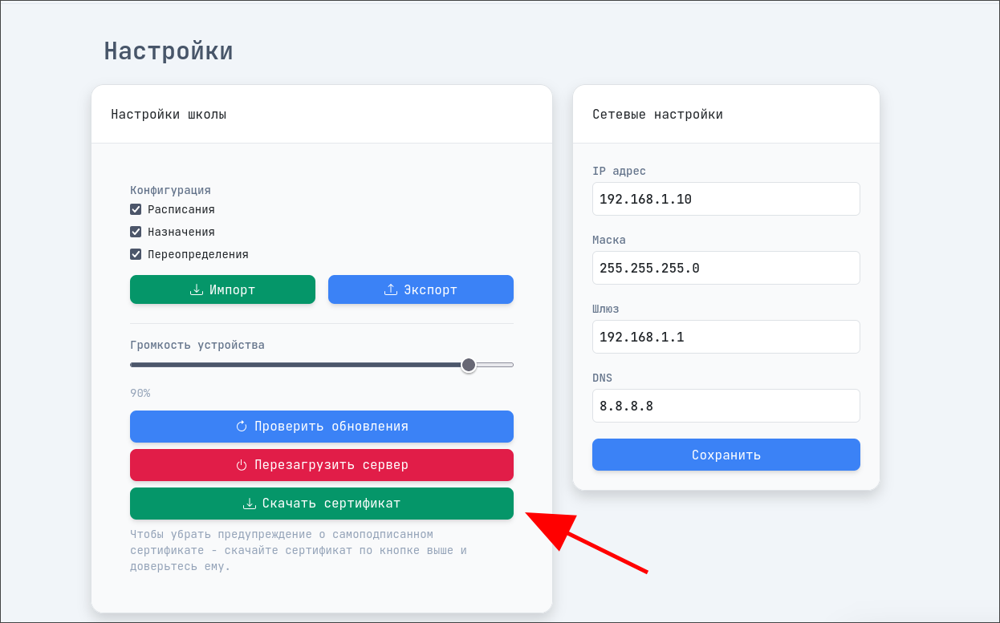

# bmaster

Система управления интеркомами (преимущественно используемая в школах) с backend на FastAPI и встроенным web-интерфейсом.


## Требования

- Python `3.13+` (см. `pyproject.toml`)
- `pip`
- `git`
- Доступ в интернет для загрузки frontend-билда при установке/обновлении
- Linux с `systemd` и `apt-get` (Debian/Ubuntu-подобные дистрибутивы)

## Быстрый старт

### 1. Клонирование

```bash
git clone https://github.com/wumtdev/bmaster.git
cd bmaster
```

### 2. Установка

Linux:

```bash
chmod +x setup.sh
./setup.sh
```

Что делает установка:

- устанавливает `uv` и зависимости проекта;
- создаёт служебные директории и файлы в `data/`;
- генерирует самоподписанный SSL сертификат (`data/cert.pem`, `data/key.pem`), если его нет;
- загружает и распаковывает последний frontend билд в `static/`;
- создаёт и включает `systemd` unit `bmaster.service` (без автозапуска сразу).

### Обновление SSL сертификата

Если нужно принудительно перевыпустить сертификат:

```bash
uv run -m bmaster.maintenance bootstrap --update-cert
```

После обновления сертификата:

- скачайте новый файл сертификата с сервера (`/api/certs/download`);
- заново добавьте его в доверенные на всех клиентах.

### 3. Запуск

Запуск через `systemd`:

```bash
sudo systemctl start bmaster.service
sudo systemctl status bmaster.service
```

По умолчанию сервер поднимается на `https://0.0.0.0:8000`.

- API документация (Swagger): `https://<ip адрес сервера>:8000/docs`
- API префикс: `/api`

## Конфигурация

Основной конфиг: `data/config.yml`.

Ключевые значения по умолчанию:

- `server.ssl.enabled: true`
- `auth.service.enabled: true`
- пароль сервисного root-доступа по умолчанию: `rpass`

После первого запуска рекомендуется сменить пароль в `data/config.yml` (`auth.service.password`).

## Обновления

### Через веб-интерфейс



### Через скрипты

Проверка обновлений:

```bash
uv run -m bmaster.maintenance check
```

Обновление backend + frontend:

```bash
uv run -m bmaster.maintenance update
```

Если `update` сообщает, что backend обновился:

```bash
sudo systemctl restart bmaster.service
```

### Совместимость со старыми командами

Legacy-энтрипоинты сохранены и продолжают работать:

```bash
python setup.py --update-cert
uv run check_updates.py
uv run update.py
```

## Дополнительная информация

Для разработки проекта использовались:

- Python 3.13+
- VS Code
- Навыки в программировании и клавиатура

```
С любовью и терпением разрабатывают и поддерживают проект frum1 и wumtdev.
2025-20xx
```
